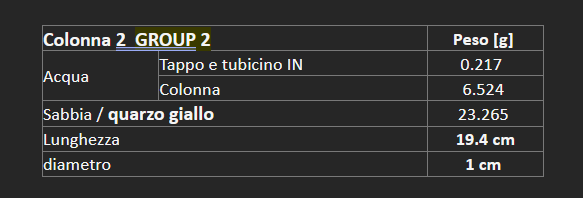
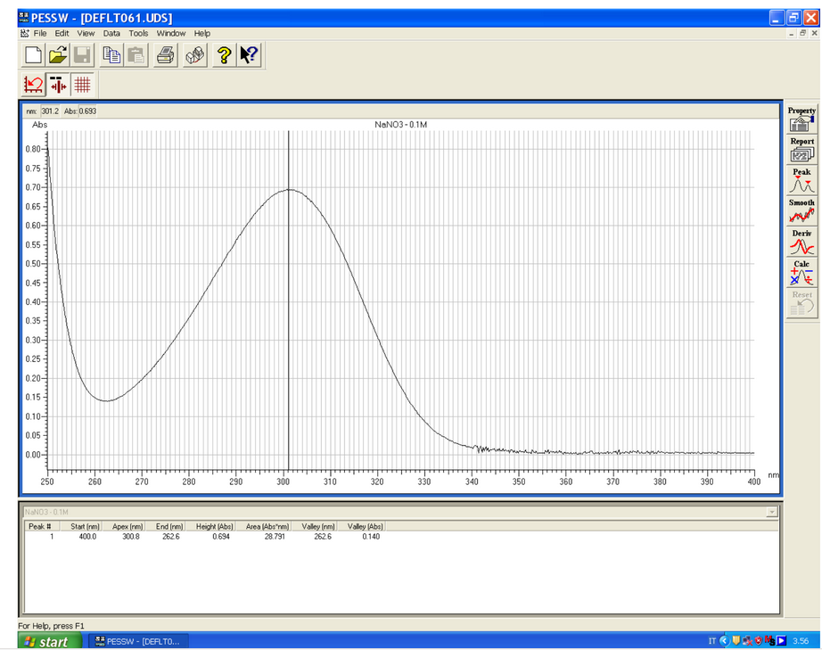

FILE DATI ESPERIMENTO IN COLONNA  

Il file ‘column exp gruppo X…. .dat’  è costituito da tre colonne. 

La prima riporta il tempo (intervallo di tempo di un secondo per ogni dato). 

La seconda riporta il peso in grammi del fluido in uscita dalla colonna e registrato dalla bilancia. 

La terza riporta il valore della trasmittanza registrata dallo spettrofotometro. 

VOLUMI DEL CIRCUITO 

Per il calcolo del tempo di attraversamento dei volumi del circuito  

In ordine sommare: 

Volume elettrovalvola             150 mm3 

Tubo in uscita dall’elettrovalvola         diametro 1,02 mm lunghezza 15 cm 

Tubo in ingresso colonna e volume morto tappo: ‘ Tappo e tubicino IN ‘ utilizzare la misura del peso dell’acqua (densità =1) iniettata con la siringa. Utilizzare lo stesso dato per tappo e tubo di uscita colonna 

Raccordo diametro 1,02 mm lunghezza 5 cm 

Tubo ingresso alla cella a flusso: è lungo circa 50 cm utilizzare la misura del peso dell’acqua che lo riempie di circa 460 mg (quindi 460 mm3) 

Volume interno cella a flusso 30 mm3 (30 microlitri) 

