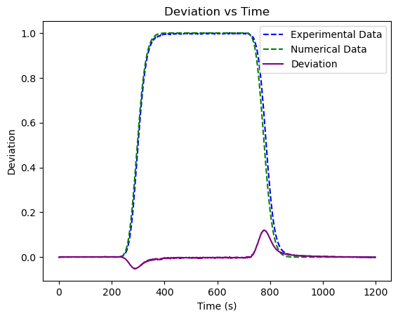
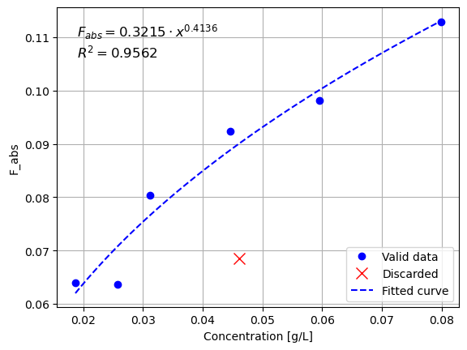
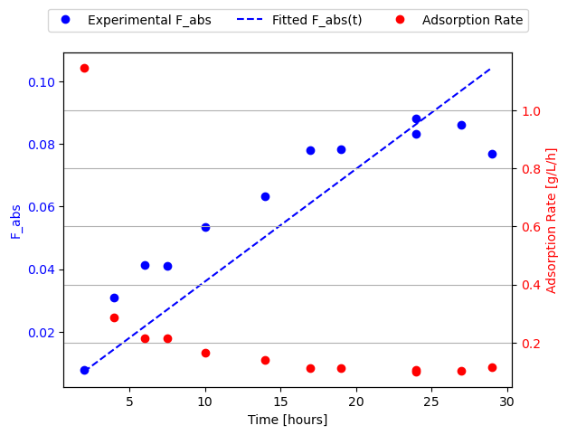

## Laboratories
> In this section I'm going to brefily sum up the activity and report crucial points just for review purposes. To actually study the content of the laboratories refer to the Jupiter Notebook in which we detailed and commented the whole process.

### Lab 1 - Transport
For this experiment we wanted to observe the transport of a contaminant. The contaminant was NaOH in water. We used the spectrophotometer to measure the concentration in time compared to the one of a water sample. The measurment is actually that of trasmitted light, which we then correlate to the concentration of the contaminant. The other experiments used this same equipment in different operating modes to get absoulte values instead of relative.

For this experiment we pumped the contaminated solution through a column of porus media, observed the resulting profile and then compared it to the solution of the Adsportion-Dispersion Equation obtained by numerical resolution (using `COTRA`).

We can see that a discrepancy at the beginning and the end of the step insertion of contaminant. Mind that the numerically solved profile was obtained setting `retardation_factor = 0` which doesn't take into account for any retardation factor in the solution of the ADE.

Moreover, from the data we also had to estimate the porosity of the porus media in different ways:
- By water mass over total volume
- By sand mass over total volume
- By sand bulk density as provided by the supplier

This showed that in a real scenario we cannot assume to have a known value and that we will obtained different results with different methods. We just assumed the porosity to be the average of the three ways but we should have also accounted for the unceranty of this average.

The pore velocity can be obtained by extracting the arrival time of the breakthough curve (half-height of the curve) and knowing the volume of water inside the system
$$
v_{pore} = \frac{length_{column}}{time_{breakthorugh}}
$$
The darcy velocity is known from the mass variation at the end of the experimental setup that was measured with a scale.
We can then compute the experimental porosity as:
$$
p = \frac{v_{dary}}{v_{pore}}
$$
Which was $-7.9%$ then the average of the three a priori methods we used before.

### Lab 2 - Adsorption
We added varying quantities of active carbon into equal phenol solutions to then measure how much of the phenol was absorbed, this is the resulting plot with a fit to a power curve. This curve is basically the equilibrium isotherm, while in class we have seen it as $F_{abs}$ vs $C$, we instead varied the mass of solid matrix but the behaviour is equivalent.  

The results are expressed in mass of phenol absorbed per mass of carbon [g/g]:
$$
F_{abs} = (C_i - C_f) \cdot \frac{V}{m_c}
$$
where:  
- $C_i$: Initial concentration [ppm]
- $C_f$: Final concentration measured [ppm]
- $V$: Volume of the solution [L]
- $m_c$: Mass of carbon [mg]

Here the procedure was quite straight forward. Notable is the fact that we use the spectrophotometer in a different way to get absolute measurments. To do so we have to use a standard solution of phenol at known concentration to compare it with an unkown one. To get a good result we select the exact wavelength we want to measure to the emission peak of phenol.

### Lab 3 - Kinetics
In this experiment we prepared equal carbon and phenol solution but then measured the phenol at different times, the result obtained is analogous the previous one.  
The data anlysis is the same as the one of LAB2 but instead of observing $F_{abs}$ over $m_{carbon}$ we observed it over time.  

In this case we should observe the behaviour in time, therefore we could use it for the non equilibrium condition. 
As seen in class we can express the sorption term as adsorption and desorption rate, which are both unknown. 
With such an experiment we can determine the ratio between the two, which is equal to the equilibrium state relationship, this way we get rid of one unkown.  

> In this experiment we didn't do any post lab activity. I made something but was not verified with the teacher.

We fit it to a function that could show an asyntom when the equilibrium is reached, kind of complicated with our data since it looks like that the equilibrium is just going to be reached towards the end of the experiment, more data would help us identify the equilibrium time. As the equilibrium is reached we can safely use the *equilibrium isotherms*

