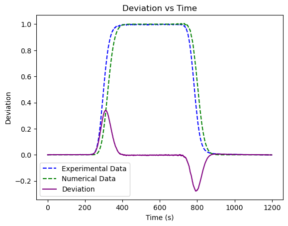
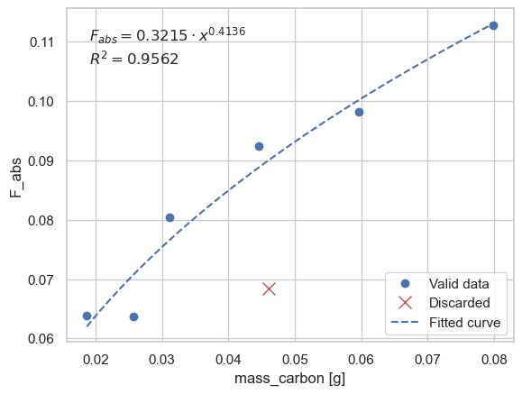
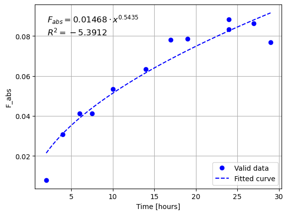

# Tranport of Radioactive Contaminants
## Introduction
> Very fast recap of the introductory concepts for this course since they are already known.

### Radioactive Waste and Repositories
Decommissioning of nuclear sites produces **radioactive waste**, which must be **characterized** (what it is made of) and **classified** (assigning a level) to ensure proper disposal.
We then reviewed the different types of repositories and their objectives:
- Isolation from the biosphere
- Isolation from human activities
- Possibility of retrieval to treat the waste in the future
- Multibarrier systems: engineered + natural

The main point of interest is that when a repository is built, we must consider how contaminants might escape following a leak. For example, geological disposals might be constructed in crystalline (Olkiluoto - Finland), clay (Andra - France), or salt-based structures, since all are natural barriers to underground water movement.

### Modelling
In modelling contaminant release, we consider three points of reference:
- Source term: What contaminant is leaking (inventory and solubility of radionuclides)
- Near Field: Migration through engineered barriers, can be quite detailed
- Far Field: Migration in the biosphere, very large areas are considered

Near field effects are what we studied in *Radioprotezione avanzata*: corrosion of a drum due to contact with water, mechanical stresses causing cracks in containment, thermal stresses, biodegradation of organic waste, etc.

Far field is the focus of this course: transport of contaminants in the biosphere mostly occurs via waterways through these physical phenomena:
- Advection - Dispersion in porous media
- Molecular Diffusion
- Solid-Liquid Interchange (Solubility/Sorption)
- Chemical Interactions (Redox or Gas Production)

**Why?** Because containment is not forever; we must acknowledge that it will fail sooner or later and determine how much will escape $\rightarrow$ We must ensure no damage to the biosphere nor the population.

Possible objectives of a study on radioactive contaminants:
- Ensure quality of drinking water (design and prevention, evaluate performance of a disposal site)
- Decide where to position monitoring wells (design of the monitoring system)
- Remediation of polluted sites 

### Aquifers
> This part is "new" but really elementary  

**An aquifer contains water that can move.** They can be:
- Superficial or **Phreatic**: easier to contaminate but also to remediate, limited below by an impermeable layer and with a free surface above
- Deep or **Confined**: difficult to contaminate and to remediate, limited above and below by impermeable layers, under pressure
  
We also have aquitard (slower moving aquifer), aquiclude (water cannot move, like in clay), aquifuge (absence of water and it cannot move, like in granite).

Artesian wells are vertical openings to an aquifer; an artesian spring is when water escapes from the aquifer due to a fault in the impermeable layer.

### Porus Media
Some definitions:
- **Porus Medium** is when space is occupied by more then 1 phase, one of which is fluid
- **Solid matrix** is the solid part of the porus medium
- **Void space** is the space not occupied by the solid
- **Dead space** are non connected voids
- **Effective space** are connected voids
  
A porous medium can be saturated if only water is present, unsaturated when both water and air (+ vapour) are present. The unsaturated zone is usually a "transition" region between the terrain surface and the saturated freatic acquifer

> **Hp**: Since the main flow of an aquifer is horizontal, we will always assume that we can consider ONLY THE HORIZONTAL FLOW. Therefore: 3D $\rightarrow$ 2D problem.

Porosity depends on:
- **Grain dimensions**
- **Degree of consolidation**: Unconsolidated are gravel, sand or clay, Consolidated are Rocks
- **Assortiment** or Granulometry Distribution: grains of same dimensions $\rightarrow$ well-sorted, otherwise poor-sorted

### Computer models
> This part was done towards the end of the course but is so insignificant that I'm just going to spend a few words here.

We have seen some code implementations of the models seen in class.
We can solve analytically the ADE as shown by the professor in a MATLAB script, I then wrote a quick Python code that solves it numerically (see `github.com\simo-pagliu\COTRA`), these approach
are fine to solve the 1D problem and visualize it but they are not practical to solve real world problems.
For this reason we have seen some model:
- Groundwater Vistas: solves the ADE numerically in 3D, the user can choose between several methods
- RESRAD: similar, but it adds exposure pathways analysis and dose assessment
- Kolmogorov-Dmitriev Models: stochastic models

> Side-note: `COTRA` uses Radau method when the Source term is active and Runge-Kutta 45 when it is not. That is beacuse when we activate a source in the shape of a step function, the ADE becomes a **stiff problem**. RK45 is an explicit method therefore not suitable for stiff problems, Radau is an implicit variation of RK that is "A-stable" therefore able to solve stiff problems (but is also quite slow)

## Definition of Main quantities
I think that's the first part of 02

## Transport Equation
Second part of 02 and content of 03
(mind that the **last page** of 02 is already in the introduction)

## Stochastic Models
Content in 05,
Jesus Christ

## Laboratories
> In this section I'm going to brefily sum up the activity and report crucial points just for review purposes. To actually study the content of the laboratories refer to the Jupiter Notebook in which we detailed and commented the whole process.
### Lab 1
For this experiment we wanted to observe the transport of a contaminant. The contaminant was NaOH in water. We used the spectrophotometer to measure the concentration in time compared to the one of a water sample. The measurment is actually that of trasmitted light, which we then correlate to the concentration of the contaminant. The other experiments used this same equipment in different operating modes to get absoulte values instead of relative.

For this experiment we pumped the contaminated solution through a column of porus media, observed the resulting profile and then compared it to the solution of the Adsportion-Dispersion Equation obtained by numerical resolution (using `COTRA`).

We can see that a discrepancy at the beginning and the end of the step insertion of contaminant. Mind that the numerically solved profile was obtained setting `retardation_factor = 0` which doesn't take into account for any retardation factor in the solution of the ADE.

Moreover, from the data we also had to estimate the porosity of the porus media in different ways:
- By water mass over total volume
- By sand mass over total volume
- By sand bulk density as provided by the supplier
This showed that in a real scenario we cannot assume to have a known value and that we will obtained different results with different methods. We just assumed the porosity to be the average of the three ways but we should have also accounted for the unceranty of this average.

The pore velocity can be obtained by extracting the arrival time of the breakthough curve (half-height of the curve) and knowing the volume of water inside the system
$$
v_{pore} = \frac{length_{column}}{time_{breakthorugh}}
$$
The darcy velocity is known from the mass variation at the end of the experimental setup that was measured with a scale.
We can then compute the experimental porosity as:
$$
p = \frac{v_{dary}}{v_{pore}}
$$
Which was $-7.9%$ then the average of the three a priori methods we used before.

### Lab 2
We added varying quantities of active carbon into equal phenol solutions to then measure how much of the phenol was absorbed, this is the resulting plot with a fit to a power curve.
The results are expressed in mass of phenol absorbed per mass of carbon [g/g]:
$$
F_{abs} = (C_i - C_f) \cdot \frac{V}{m_c}
$$
where:  
- $C_i$: Initial concentration [ppm]
- $C_f$: Final concentration measured [ppm]
- $V$: Volume of the solution [L]
- $m_c$: Mass of carbon [mg]

Here the procedure was quite straight forward. Notable is the fact that we use the spectrophotometer in a different way to get absolute measurments. To do so we have to use a standard solution of phenol at known concentration to compare it with an unkown one. To get a good result we select the exact wavelength we want to measure to the emission peak of phenol.

### Lab 3
In this experiment we prepared equal carbon and phenol solution but then measured the phenol at different times, the result obtained is analogous the previous one.
